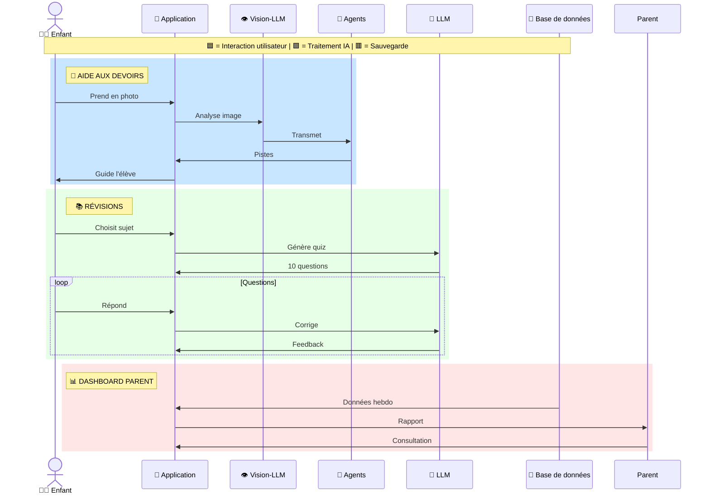

# Workflow pour l'api

```mermaid
sequenceDiagram
    %% Définition des couleurs
    actor Enfant as 👨‍🎓 Enfant
    participant App as 📱 Application
    participant Vision as 👁️ Vision-LLM
    participant Agents as 🧠 Agents
    participant LLM as 🤖 LLM
    participant DB as 💾 Base de données

    %% Légende des couleurs
    Note over Enfant,DB: 🟦 = Interaction utilisateur | 🟩 = Traitement IA | 🟥 = Sauvegarde

    %% Aide aux devoirs
    rect rgb(200, 230, 255)
        Note right of Enfant: 📸 AIDE AUX DEVOIRS
        Enfant->>App: Prend en photo
        App->>Vision: Analyse image
        Vision->>Agents: Transmet
        Agents->>App: Pistes
        App->>Enfant: Guide l'élève
    end

    %% Mode révisions
    rect rgb(230, 255, 230)
        Note right of Enfant: 📚 RÉVISIONS
        Enfant->>App: Choisit sujet
        App->>LLM: Génère quiz
        LLM->>App: 10 questions
        loop Questions
            Enfant->>App: Répond
            App->>LLM: Corrige
            LLM->>App: Feedback
        end
    end

    %% Dashboard parent
    rect rgb(255, 230, 230)
        Note right of Enfant: 📊 DASHBOARD PARENT
        DB->>App: Données hebdo
        App->>Parent: Rapport
        Parent->>App: Consultation
    end
```
